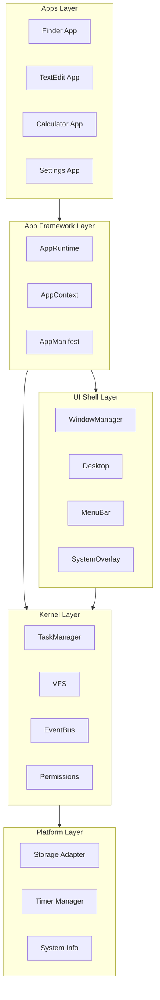

# Architecture Redesign Proposal

> **Generated**: December 3, 2025  
> **Status**: Draft  
> **Risk Level**: High (Major restructuring required)

---

## Executive Summary

This document proposes a comprehensive architecture redesign to align the current macOS 98 implementation with the 5-layer architecture defined in the design specifications. The current implementation has significant gaps—three entire layers (Platform, Kernel, App Framework) are missing, and the existing code suffers from tight coupling and a "god object" anti-pattern.

**Recommendation**: Pursue an **incremental migration** rather than a full rewrite, implementing layers bottom-up while maintaining backward compatibility.

---

## 1. Current vs. Proposed Architecture

### 1.1 Visual Comparison

```
┌─────────────────────────────────────────────────────────────────────────────┐
│                    CURRENT ARCHITECTURE                                     │
├─────────────────────────────────────────────────────────────────────────────┤
│                                                                             │
│  ┌──────────────────────────────────────────────────────────────────────┐   │
│  │                         App.tsx                                      │   │
│  │                    (DesktopProvider)                                 │   │
│  │                            │                                         │   │
│  │                    ┌───────▼───────┐                                 │   │
│  │                    │   Desktop.tsx │                                 │   │
│  │                    └───────┬───────┘                                 │   │
│  │                            │                                         │   │
│  │              ┌─────────────▼─────────────┐                           │   │
│  │              │    useDesktopLogic.tsx    │ ◄── GOD OBJECT            │   │
│  │              │  (ALL state & logic here) │                           │   │
│  │              └─────────────┬─────────────┘                           │   │
│  │                            │                                         │   │
│  │    ┌───────┬───────┬───────┼───────┬───────┬───────┐                 │   │
│  │    ▼       ▼       ▼       ▼       ▼       ▼       ▼                 │   │
│  │ MenuBar Window  Icon  Context  Info   Apps   Utils                   │   │
│  │                                   │                                  │   │
│  │                      Calculator, Finder, TicTacToe, TextEditor       │   │
│  └──────────────────────────────────────────────────────────────────────┘   │
│                                                                             │
│  ❌ No Platform Layer     ❌ No Kernel Layer     ❌ No App Framework         │
│  ❌ No Persistence        ❌ No Event Bus        ❌ No Task Manager          │
│                                                                             │
└─────────────────────────────────────────────────────────────────────────────┘

                                    ▼▼▼

┌────────────────────────────────────────────────────────────────────────────┐
│                   PROPOSED ARCHITECTURE (from design-docs)                 │
├────────────────────────────────────────────────────────────────────────────┤
│                                                                            │
│  ┌─────────────────────────────────────────────────────────────────────┐   │
│  │                        APPS LAYER                                   │   │
│  │         Finder │ TextEdit │ Calculator │ TicTacToe │ About          │   │
│  │             (Each app has Manifest + Lifecycle hooks)               │   │
│  ├─────────────────────────────────────────────────────────────────────┤   │
│  │                    APP FRAMEWORK LAYER                              │   │
│  │          AppRuntime │ AppContext │ AppManifest │ SDK                │   │
│  │        (Resource hosting, lifecycle, scoped file system)            │   │
│  ├─────────────────────────────────────────────────────────────────────┤   │
│  │                      UI SHELL LAYER                                 │   │
│  │      WindowManager │ Desktop │ MenuBar │ SystemOverlay              │   │
│  │         (Decoupled services with clear interfaces)                  │   │
│  ├─────────────────────────────────────────────────────────────────────┤   │
│  │                       KERNEL LAYER                                  │   │
│  │     TaskManager │ VFS │ EventBus │ Permissions │ Scheduler          │   │
│  │        (OS-like abstractions, persistence, IPC)                     │   │
│  ├─────────────────────────────────────────────────────────────────────┤   │
│  │                      PLATFORM LAYER                                 │   │
│  │            Storage │ Timer │ System │ DOM Abstraction               │   │
│  │           (Browser API encapsulation, testable)                     │   │
│  └─────────────────────────────────────────────────────────────────────┘   │
│                                                                            │
└────────────────────────────────────────────────────────────────────────────┘
```

### 1.2 Layer Implementation Gap Analysis

| Layer | Design Spec | Current Status | Gap Severity |
|-------|-------------|----------------|--------------|
| **Platform** | `platform/storage`, `platform/timer`, `platform/system` | ❌ Not implemented | 🔴 Critical |
| **Kernel** | `TaskManager`, `VFS`, `EventBus`, `Permissions` | ❌ Not implemented | 🔴 Critical |
| **UI Shell** | `WindowManager`, `Desktop`, `MenuBar`, `SystemOverlay` | ⚠️ Partial (monolithic) | 🟡 Major |
| **App Framework** | `AppRuntime`, `AppContext`, `AppManifest` | ❌ Not implemented | 🔴 Critical |
| **Apps** | Lifecycle-aware, manifest-driven | ⚠️ Simple components | 🟡 Major |

---

## 2. Prioritized Issue List

### 2.1 Critical Issues (Must Fix)

| # | Issue | Location | SOLID Violation | Impact |
|---|-------|----------|-----------------|--------|
| **C1** | God Object | `useDesktopLogic.tsx` | SRP, OCP | All state/logic in one 400-line hook; impossible to extend without modification |
| **C2** | No Persistence | Global | — | All user data lost on page refresh; violates MVP success criteria |
| **C3** | React Nodes in State | `useDesktopLogic.tsx:28` | — | `content: React.ReactNode` not serializable; blocks persistence |
| **C4** | Direct Browser API Access | `Window.tsx`, `MenuBar.tsx` | DIP | Components use `window.addEventListener` directly; resource leaks on unmount |
| **C5** | No App Lifecycle | All apps | — | Apps can't clean up resources; memory leaks inevitable |

### 2.2 Major Issues (Should Fix)

| # | Issue | Location | SOLID Violation | Impact |
|---|-------|----------|-----------------|--------|
| **M1** | Tight Coupling | `Desktop.tsx` ↔ `useDesktopLogic` | DIP | Desktop directly depends on concrete hook; no abstraction |
| **M2** | No Event System | Global | — | Components communicate via prop drilling; brittle |
| **M3** | Hardcoded Apps | `initialState.ts` | OCP | Adding new apps requires modifying core files |
| **M4** | No Z-Index Strategy | `Window.tsx` | — | Using CSS variables but not DOM-order-based z-index |
| **M5** | Missing Error Boundaries | `App.tsx` | — | Single app crash takes down entire desktop |

### 2.3 Minor Issues (Nice to Fix)

| # | Issue | Location | Impact |
|---|-------|----------|--------|
| **m1** | `document.execCommand` | `TextEditor.tsx` | Deprecated API |
| **m2** | Magic Numbers | `iconLayout.ts` | Maintainability |
| **m3** | Mixed i18n | Multiple | UI inconsistency |
| **m4** | External Font CDN | `global.scss` | Privacy/reliability |

---

## 3. New Architecture Proposal

### 3.1 Module Dependency Graph (Proposed)



### 3.2 Interface Contracts

#### Platform Layer

```typescript
// src/platform/storage.ts
interface StorageAdapter {
  open(dbName: string, version: number, upgrade: UpgradeFn): Promise<Database>
  close(db: Database): void
  delete(dbName: string): Promise<void>
}

interface Database {
  get<T>(store: string, key: IDBValidKey): Promise<T | undefined>
  put<T>(store: string, key: IDBValidKey, value: T): Promise<void>
  delete(store: string, key: IDBValidKey): Promise<void>
  getAll<T>(store: string): Promise<T[]>
}

// src/platform/timer.ts
interface TimerManager {
  setTimeout(callback: () => void, ms: number): TimerId
  setInterval(callback: () => void, ms: number): TimerId
  clearTimeout(id: TimerId): void
  clearInterval(id: TimerId): void
  clearAll(): void  // Critical for app cleanup
}
```

#### Kernel Layer

```typescript
// src/kernel/vfs.ts
interface VirtualFileSystem {
  mkdir(path: string): Promise<void>
  readdir(path: string): Promise<string[]>
  readFile(path: string): Promise<string>
  writeFile(path: string, data: string): Promise<void>
  deleteFile(path: string): Promise<void>
  stat(path: string): Promise<VfsStat>
  exists(path: string): Promise<boolean>
  watch(path: string, callback: (event: VfsEvent) => void): Unsubscribe
}

// src/kernel/task-manager.ts
interface TaskManager {
  spawn(appId: string): Task
  suspend(taskId: string): void
  resume(taskId: string): void
  kill(taskId: string): void
  getTask(taskId: string): Task | undefined
  getAllTasks(): Task[]
}

// src/kernel/event-bus.ts
interface EventBus {
  publish<T>(event: string, payload?: T): void
  subscribe<T>(event: string, callback: (payload: T) => void): Unsubscribe
  createChannel(namespace: string): EventChannel
}
```

#### App Framework Layer

```typescript
// src/app-framework/context.ts
interface AppContext {
  readonly appId: string
  readonly taskId: string
  readonly manifest: AppManifest
  
  // Managed resources (tracked for cleanup)
  setTimeout(callback: () => void, ms: number): number
  setInterval(callback: () => void, ms: number): number
  addEventListener(event: string, handler: EventHandler): void
  
  // Scoped file system (permission-checked)
  readonly fs: ScopedFileSystem
  
  // Window operations
  openWindow(options: OpenWindowOptions): Window
  closeWindow(windowId: string): void
  
  // Lifecycle
  onTerminate(callback: () => void): void
  dispose(): void  // Called by system, cleans all resources
}

// src/app-framework/runtime.ts
interface AppRuntime {
  registerApp(manifest: AppManifest, factory: AppFactory): void
  launchApp(appId: string, options?: LaunchOptions): Task
  terminateApp(taskId: string): void
  getInstalledApps(): AppManifest[]
  getRunningApps(): RunningApp[]
}
```

### 3.3 Component Responsibility Redistribution

| Current | Proposed | Responsibility |
|---------|----------|----------------|
| `useDesktopLogic` (monolith) | Split into multiple services | — |
| → window state | `WindowManager` | Window CRUD, focus, z-order |
| → icon state | `Desktop` service | Icon positions, selection |
| → clipboard | `ClipboardService` (kernel) | Cut/copy/paste operations |
| → history | `UndoManager` (kernel) | Action history stack |
| → context menu | `ContextMenuService` (UI) | Menu display/positioning |
| `DesktopContext` | `EventBus` + services | Background, settings |
| `initialState.ts` | `AppManifest` files | App declarations |

---

## 4. Migration Plan

### 4.1 Phase Overview

```
Phase 0 ──▶ Phase 1 ──▶ Phase 2 ──▶ Phase 3 ──▶ Phase 4 ──▶ Phase 5
 Prep      Platform     Kernel      UI Shell    App FW     Apps
 (1 day)   (3 days)     (5 days)    (3 days)    (4 days)   (3 days)
```

**Total Estimated Duration**: ~3 weeks

### 4.2 Phase Details

#### Phase 0: Preparation (1 day)

**Goal**: Set up infrastructure for incremental migration

| Task | Description | Risk |
|------|-------------|------|
| Create directory structure | `src/platform/`, `src/kernel/`, `src/ui-shell/`, `src/app-framework/` | Low |
| Add TypeScript path aliases | Configure `@platform/*`, `@kernel/*`, etc. | Low |
| Set up barrel exports | `index.ts` files for clean imports | Low |
| Create adapter interfaces | Allow old code to work with new modules | Low |

**Deliverables**:
- [ ] New directory structure created
- [ ] Path aliases configured in `tsconfig.json`
- [ ] All existing tests still pass

---

#### Phase 1: Platform Layer (3 days)

**Goal**: Abstract browser APIs for testability

| Task | Priority | Complexity | Dependencies |
|------|----------|------------|--------------|
| `platform/storage` - IndexedDB wrapper | P0 | Medium | None |
| `platform/timer` - Managed timers | P0 | Low | None |
| `platform/system` - Capability detection | P1 | Low | None |
| Unit tests for all modules | P0 | Medium | Above |

**Breaking Changes**: None (new code, no existing dependencies)

**Rollback Strategy**: Delete `src/platform/` directory

**Deliverables**:
- [ ] `StorageAdapter` with IndexedDB implementation
- [ ] `TimerManager` with clearAll() support
- [ ] `SystemInfo` with capability checks
- [ ] 100% test coverage for platform layer

---

#### Phase 2: Kernel Layer (5 days)

**Goal**: Implement OS-like abstractions

| Task | Priority | Complexity | Dependencies |
|------|----------|------------|--------------|
| `kernel/event-bus` - Pub/sub system | P0 | Low | None |
| `kernel/vfs` - Virtual file system | P0 | High | `platform/storage` |
| `kernel/task-manager` - Task lifecycle | P0 | Medium | `kernel/event-bus` |
| `kernel/permissions` - Access control | P1 | Medium | None |
| VFS persistence tests | P0 | Medium | `kernel/vfs` |

**Breaking Changes**: 
- `initialState.ts` → `kernel/vfs` initial structure

**Migration Strategy**:
1. Keep `initialState.ts` temporarily
2. Create VFS with same initial data
3. Update consumers one-by-one
4. Delete `initialState.ts`

**Deliverables**:
- [ ] `EventBus` with channel isolation
- [ ] `VFS` with IndexedDB persistence
- [ ] `TaskManager` with spawn/kill
- [ ] Files persist across page refresh (MVP criteria ✓)

---

#### Phase 3: UI Shell Refactor (3 days)

**Goal**: Decouple UI components from logic hook

| Task | Priority | Complexity | Dependencies |
|------|----------|------------|--------------|
| Extract `WindowManager` service | P0 | High | `kernel/event-bus` |
| Extract `DesktopService` | P0 | Medium | `kernel/vfs` |
| Create `SystemOverlay` portal | P1 | Medium | None |
| Refactor `MenuBar` to use EventBus | P1 | Low | `kernel/event-bus` |
| Deprecate `useDesktopLogic` | P0 | High | Above |

**Breaking Changes**:
- `useDesktopLogic` → multiple services
- Props interface changes for `Desktop`, `Window`, `MenuBar`

**Migration Strategy**:
1. Create new services alongside `useDesktopLogic`
2. Move logic piece by piece (windows → icons → clipboard → history)
3. Update components to use new services
4. Delete `useDesktopLogic` when empty

**Rollback Strategy**: 
- Keep `useDesktopLogic` as fallback
- Feature flag: `USE_NEW_ARCHITECTURE=true`

**Deliverables**:
- [ ] `WindowManager` as standalone service
- [ ] `DesktopService` for icon management
- [ ] `SystemOverlay` for portaled dialogs
- [ ] `useDesktopLogic` deleted or deprecated

---

#### Phase 4: App Framework (4 days)

**Goal**: Implement app lifecycle and resource management

| Task | Priority | Complexity | Dependencies |
|------|----------|------------|--------------|
| `AppManifest` schema and validation | P0 | Low | None |
| `AppContext` with resource tracking | P0 | High | `platform/timer`, `kernel/event-bus` |
| `AppRuntime` with launch/terminate | P0 | High | `kernel/task-manager` |
| `ScopedFileSystem` wrapper | P1 | Medium | `kernel/vfs`, `kernel/permissions` |
| Migrate one app (Calculator) | P0 | Medium | Above |

**Breaking Changes**:
- App components → App instances with lifecycle
- Direct imports → `AppContext` dependency injection

**Migration Strategy**:
1. Create `AppRuntime` that can host old-style components
2. Migrate Calculator as proof-of-concept
3. Document app migration guide
4. Migrate remaining apps incrementally

**Deliverables**:
- [ ] `AppManifest` type and sample manifests
- [ ] `AppContext` with managed timers/listeners
- [ ] `AppRuntime` with launch/terminate
- [ ] Calculator migrated to new framework

---

#### Phase 5: App Migration (3 days)

**Goal**: Migrate all apps to new framework

| App | Complexity | Special Considerations |
|-----|------------|------------------------|
| Calculator | Low | Already done in Phase 4 |
| TicTacToe | Low | Simple state, no file access |
| About | Low | Static content |
| BackgroundSwitcher | Low | Needs settings persistence |
| TextEditor | High | File save/load via ScopedFS |
| Finder | High | VFS integration, file associations |

**Deliverables**:
- [ ] All apps have `AppManifest` files
- [ ] All apps use `AppContext` for resources
- [ ] Memory leak test: Open/close apps 100x, verify stable heap

---

## 5. Breaking Changes Inventory

| Change | Affected Files | Migration Required |
|--------|----------------|-------------------|
| `useDesktopLogic` removal | `Desktop.tsx` | Update to use services |
| `WindowData.content` type change | `useDesktopLogic.tsx`, `Window.tsx` | Use component registry |
| `initialState.ts` deprecation | `useDesktopLogic.tsx` | Use VFS |
| Direct `window.*` calls removal | `Window.tsx`, `MenuBar.tsx`, `DesktopIcon.tsx` | Use `AppContext` |
| Props interface changes | All OS components | Update prop types |

---

## 6. Rollback Strategy

### Per-Phase Rollback

| Phase | Rollback Method | Data Loss Risk |
|-------|-----------------|----------------|
| Phase 1 | Delete `src/platform/` | None |
| Phase 2 | Delete `src/kernel/`, restore `initialState.ts` | VFS data lost |
| Phase 3 | Restore `useDesktopLogic` from git | None |
| Phase 4 | Delete `src/app-framework/`, restore app components | None |
| Phase 5 | Restore app components from git | None |

### Full Rollback

```bash
git checkout main -- src/
git checkout main -- tsconfig.json
pnpm install
pnpm test  # Verify tests pass
```

---

## 7. Success Metrics

| Metric | Current | Target | Measurement |
|--------|---------|--------|-------------|
| Test Coverage | ~60% | >80% | `vitest --coverage` |
| Files persisted after refresh | ❌ No | ✅ Yes | Manual test |
| Memory leak (100 open/close cycles) | Unknown | <10MB growth | Chrome DevTools heap snapshot |
| App startup time | N/A | <100ms | Performance.now() |
| Lines in largest file | 410 (`useDesktopLogic`) | <200 | `wc -l` |
| Cyclomatic complexity (max) | Unknown | <15 | ESLint plugin |

---

## 8. Risk Assessment

| Risk | Probability | Impact | Mitigation |
|------|-------------|--------|------------|
| Phase 3 breaks existing functionality | High | High | Feature flags, parallel implementations |
| VFS migration loses data format compatibility | Medium | Medium | Version migration scripts |
| Team unfamiliarity with new patterns | Medium | Medium | Documentation, pair programming |
| Scope creep during refactor | High | Medium | Strict phase boundaries, PR reviews |
| Performance regression | Low | Medium | Benchmark before/after each phase |

---

## 9. Appendix: File Mapping

### Current → Proposed Structure

```
CURRENT                          PROPOSED
─────────────────────────────────────────────────────────────────
src/
├── App.tsx                      src/App.tsx (minimal bootstrap)
├── main.tsx                     src/main.tsx
├── components/
│   ├── apps/
│   │   ├── Calculator.tsx       src/apps/calculator/
│   │   │                        ├── manifest.json
│   │   │                        ├── index.ts (factory)
│   │   │                        └── CalculatorView.tsx
│   │   ├── Finder.tsx           src/apps/finder/...
│   │   ├── TextEditor.tsx       src/apps/text-editor/...
│   │   └── ...
│   └── os/
│       ├── Desktop.tsx          src/ui-shell/desktop/
│       ├── Window.tsx           src/ui-shell/window/
│       ├── MenuBar.tsx          src/ui-shell/menu-bar/
│       └── ...
├── contexts/
│   └── DesktopContext.tsx       DELETE (replaced by EventBus)
├── hooks/
│   └── useDesktopLogic.tsx      DELETE (replaced by services)
├── config/
│   └── initialState.ts          DELETE (replaced by VFS init)
├── utils/
│   └── iconLayout.ts            src/ui-shell/desktop/iconLayout.ts
└── styles/                      src/styles/ (unchanged)

NEW DIRECTORIES:
─────────────────────────────────────────────────────────────────
src/
├── platform/
│   ├── storage.ts
│   ├── timer.ts
│   ├── system.ts
│   └── index.ts
├── kernel/
│   ├── vfs/
│   ├── task-manager/
│   ├── event-bus/
│   ├── permissions/
│   └── index.ts
├── ui-shell/
│   ├── window-manager/
│   ├── desktop/
│   ├── menu-bar/
│   ├── system-overlay/
│   └── index.ts
├── app-framework/
│   ├── manifest.ts
│   ├── context.ts
│   ├── runtime.ts
│   └── index.ts
└── apps/
    ├── calculator/
    ├── finder/
    ├── text-editor/
    ├── tic-tac-toe/
    ├── about/
    └── background-switcher/
```

---

## 10. Next Steps

1. **Review this document** with stakeholders
2. **Approve migration plan** and timeline
3. **Create Phase 0 branch** and begin directory setup
4. **Establish testing baseline** before any changes
5. **Begin Phase 1** implementation

---

*End of Architecture Redesign Proposal*

