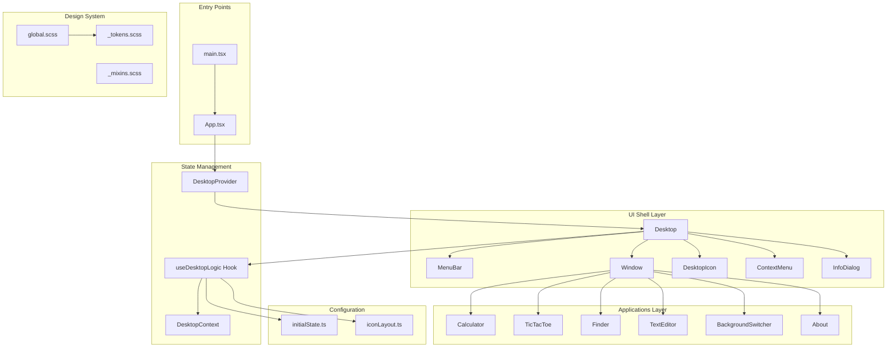
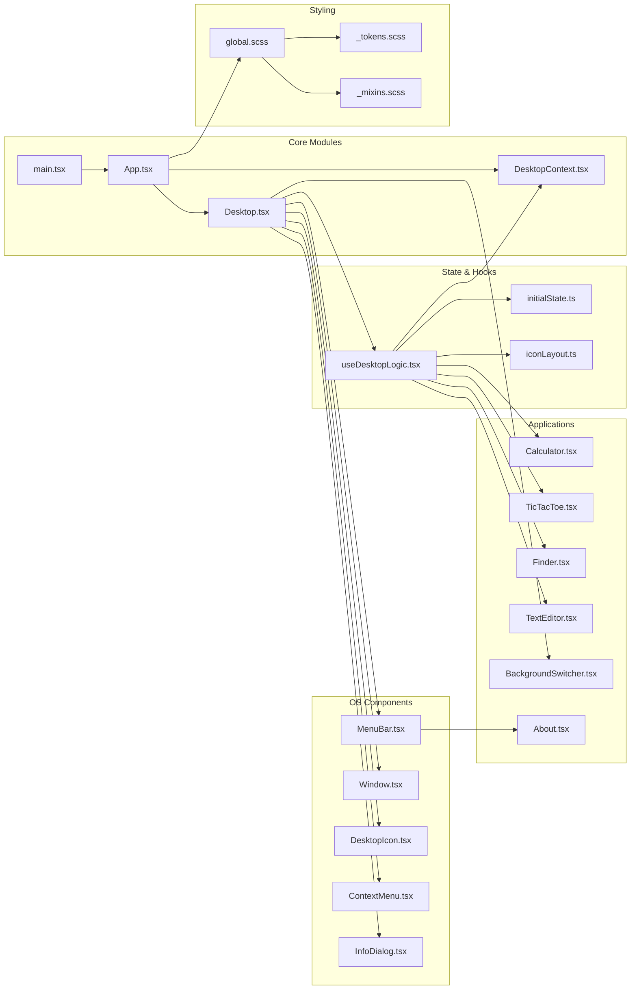
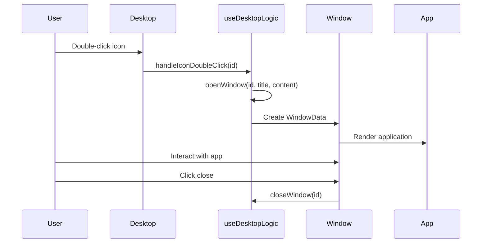
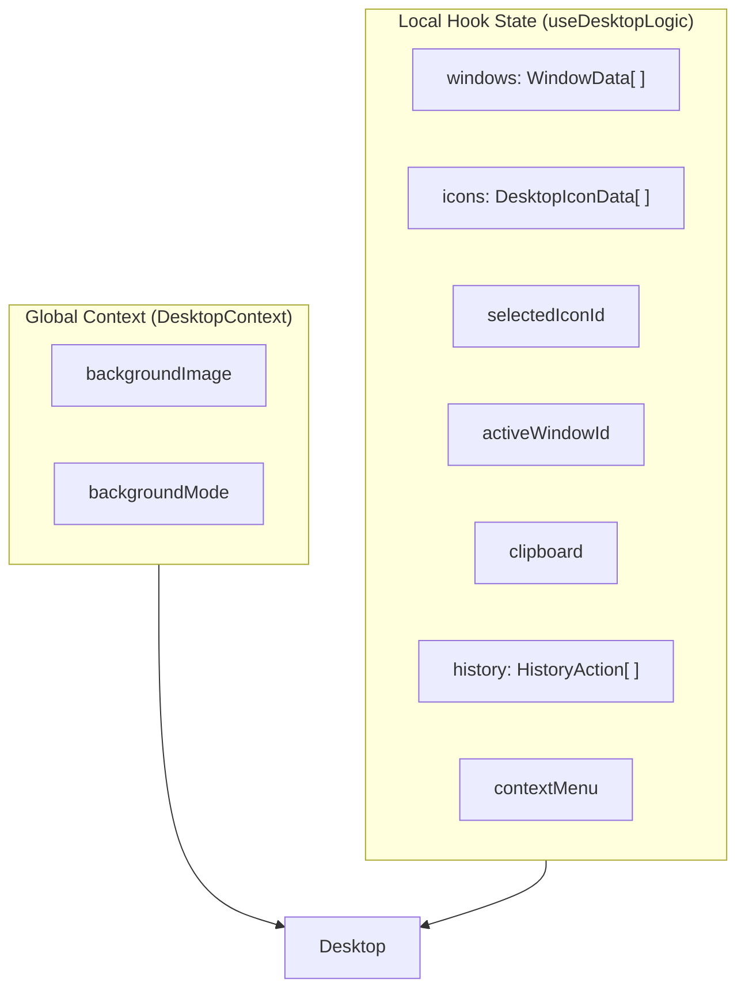

# macOS 98 Project Analysis Report

> **Generated**: December 3, 2025  
> **Analyst**: AI Discovery Agent  
> **Project Version**: 0.0.0

---

## Executive Summary

**macOS 98** is a browser-based simulation of the classic Mac OS 7/9 desktop environment, built as a single-page application using React 19, TypeScript, and Vite. The project authentically recreates the late-90s Macintosh UI aesthetic including draggable windows, desktop icons, menu bar, context menus, and several built-in applications.

---

## 1. Architecture Diagram



---

## 2. Module Dependency Graph



---

## 3. Tech Stack Inventory

### Core Framework

| Technology | Version | Purpose |
|------------|---------|---------|
| React | ^19.2.0 | UI framework with concurrent features |
| React DOM | ^19.2.0 | Browser rendering |
| TypeScript | ~5.9.3 | Type safety and developer experience |
| Vite | ^7.2.4 | Build tool and dev server with HMR |

### Styling

| Technology | Version | Purpose |
|------------|---------|---------|
| Sass | ^1.94.2 | SCSS preprocessing |
| CSS Modules | (built-in) | Scoped component styles |
| CSS Custom Properties | (native) | Runtime theming tokens |

### Testing

| Technology | Version | Purpose |
|------------|---------|---------|
| Vitest | ^4.0.12 | Unit test runner |
| @testing-library/react | ^16.3.0 | React component testing |
| @testing-library/dom | ^10.4.1 | DOM testing utilities |
| @testing-library/jest-dom | ^6.9.1 | Custom DOM matchers |
| @testing-library/user-event | ^14.6.1 | User interaction simulation |
| jsdom | ^27.2.0 | Browser environment for tests |

### Linting & Code Quality

| Technology | Version | Purpose |
|------------|---------|---------|
| ESLint | ^9.39.1 | JavaScript/TypeScript linting |
| typescript-eslint | ^8.46.4 | TypeScript-specific rules |
| eslint-plugin-react-hooks | ^7.0.1 | React hooks linting |
| eslint-plugin-react-refresh | ^0.4.24 | Fast refresh compatibility |
| Stylelint | ^16.26.0 | SCSS linting |
| stylelint-config-standard-scss | ^16.0.0 | Standard SCSS rules |

### Build Configuration

| File | Purpose |
|------|---------|
| `vite.config.ts` | Vite build configuration with `/macos98/` base path |
| `vitest.config.ts` | Test configuration with jsdom environment |
| `tsconfig.json` | TypeScript project references |
| `tsconfig.app.json` | Application TypeScript config |
| `tsconfig.node.json` | Node/Vite TypeScript config |

---

## 4. Business Logic Analysis

### 4.1 Project Purpose

macOS 98 recreates the nostalgic Mac OS 7/9 desktop experience in a web browser, providing:

1. **Authentic Visual Recreation**: Pixel-accurate recreation of classic Mac UI elements
2. **Interactive Desktop Environment**: Draggable icons, windows, and context menus
3. **Functional Applications**: Working calculator, file browser, text editor, and games
4. **Educational/Portfolio Value**: Demonstrates React architecture and retro UI design

### 4.2 Core Workflows

#### Desktop Interaction Flow



#### State Management Architecture



### 4.3 Data Models

#### Core Types

```typescript
// Window representation
interface WindowData {
    id: string
    title: string
    x: number
    y: number
    width: number
    height: number
    content: React.ReactNode
}

// Desktop icon representation
interface DesktopIconData {
    id: string
    label: string
    icon: string
    x: number
    y: number
    type?: 'folder' | 'file' | 'app' | 'system'
    children?: FileItem[]
    onDoubleClick: () => void
}

// Virtual file system item
interface FileItem {
    id: string
    name: string
    type: 'folder' | 'file' | 'app' | 'system'
    icon: string
    children?: FileItem[]
    content?: string
}
```

### 4.4 Feature Inventory

| Feature | Status | Implementation |
|---------|--------|----------------|
| Draggable Windows | ✅ Complete | `Window.tsx` with mouse events |
| Window Collapse/Zoom | ✅ Complete | Title bar controls |
| Desktop Icons | ✅ Complete | `DesktopIcon.tsx` with drag support |
| Icon Selection | ✅ Complete | Single-select with visual feedback |
| Menu Bar | ✅ Complete | Apple, File, Edit, View menus |
| Context Menu | ✅ Complete | Right-click on desktop |
| Clipboard | ✅ Complete | Cut/Copy/Paste icons |
| Undo History | ✅ Complete | Action history stack |
| Calculator App | ✅ Complete | Full arithmetic operations |
| TicTacToe Game | ✅ Complete | Two-player game |
| Finder | ✅ Complete | File browser with breadcrumbs |
| TextEditor | ✅ Complete | Rich text editing |
| Background Switcher | ✅ Complete | Multiple wallpapers & modes |
| About Dialog | ✅ Complete | System information |
| Icon Cleanup | ✅ Complete | Auto-arrange icons |

---

## 5. Integration Points & System Boundaries

### 5.1 External Dependencies

| Boundary | Type | Description |
|----------|------|-------------|
| Browser DOM | Platform | Standard DOM APIs for rendering |
| Browser Events | Platform | Mouse, keyboard event handling |
| Local Storage | Not Used | Potential for persistence |
| Network | External Font | Chicago font loaded from webfont CDN |

### 5.2 Asset Management

```
src/assets/
├── background/          # Desktop wallpapers
│   ├── backgroundAssets.ts  # Asset registry
│   └── *.jpeg           # Image files
├── apple_logo.png       # System branding
├── calculator.png       # App icons
├── folder_icon.png
├── hd_icon.png
├── joystick.png
├── pattern_bg.png       # Default background
└── trash_icon.png
```

### 5.3 Build Output

- **Base Path**: `/macos98/` (for GitHub Pages deployment)
- **Output Directory**: `dist/`
- **Assets**: Hashed filenames for cache busting

---

## 6. Key Design Decisions & Rationale

### Decision 1: Custom Hook for Desktop Logic

**Choice**: Extract all desktop state management into `useDesktopLogic` hook

**Rationale**:
- Separates UI rendering from business logic
- Makes state testable independently
- Allows Desktop component to remain declarative

### Decision 2: React Context for Global State

**Choice**: Use DesktopContext for background settings only

**Rationale**:
- Background affects entire desktop, true global state
- Window/icon state is complex and benefits from local hook state
- Avoids over-globalization of state

### Decision 3: CSS Custom Properties + SCSS Tokens

**Choice**: Define colors as CSS variables, reference via SCSS tokens

**Rationale**:
- Runtime theming capability (future dark mode, etc.)
- SCSS provides compile-time convenience
- Authentic OS9 5-value gray scale palette

### Decision 4: Component-Scoped SCSS Modules

**Choice**: Each component has its own `.module.scss` file

**Rationale**:
- Zero CSS conflicts between components
- Enables confident refactoring
- Matches React component mental model

### Decision 5: Functional Components Only

**Choice**: No class components, pure hooks architecture

**Rationale**:
- React 19 best practices
- Better TypeScript inference
- Easier testing and composition

---

## 7. Identified Technical Debt

### High Priority

| Issue | Location | Impact | Recommendation |
|-------|----------|--------|----------------|
| `document.execCommand` usage | TextEditor.tsx | Deprecated API, browser support varies | Migrate to custom text manipulation or contenteditable library |
| Window content in state | useDesktopLogic.tsx | React nodes stored in state, not serializable | Use window registry pattern with component lookup |

### Medium Priority

| Issue | Location | Impact | Recommendation |
|-------|----------|--------|----------------|
| No persistence | Global | State lost on refresh | Add localStorage/IndexedDB persistence |
| Limited keyboard support | Multiple | Accessibility concern | Add keyboard shortcuts and focus management |
| Magic numbers | iconLayout.ts | Hard to maintain layout constants | Extract to configuration |
| Missing error boundaries | App.tsx | App crash affects whole system | Add error boundaries per window |

### Low Priority

| Issue | Location | Impact | Recommendation |
|-------|----------|--------|----------------|
| External font dependency | global.scss | Potential FOUT, privacy | Self-host Chicago font |
| No window resize | Window.tsx | Fixed window sizes | Add resize handles |
| Missing i18n | Multiple | UI is mixed English/Chinese | Consolidate to single language or add i18n |

---

## 8. Recommendations for Onboarding

### Quick Start

```bash
# Install dependencies
pnpm install

# Start development server
pnpm dev

# Run tests
pnpm test

# Build for production
pnpm build
```

### Understanding the Codebase

1. **Start with `App.tsx`** — See how DesktopProvider wraps Desktop
2. **Read `useDesktopLogic.tsx`** — Central state management hub
3. **Explore `Desktop.tsx`** — Main composition of all OS components
4. **Study `Window.tsx`** — Window behavior: drag, collapse, zoom
5. **Review an app like `Calculator.tsx`** — Self-contained application pattern

### Key Files to Know

| File | Purpose |
|------|---------|
| `src/hooks/useDesktopLogic.tsx` | All desktop state and operations |
| `src/contexts/DesktopContext.tsx` | Background image/mode global state |
| `src/config/initialState.ts` | Default icons and file structure |
| `src/styles/_tokens.scss` | Design system tokens |
| `src/styles/global.scss` | Base styles and CSS custom properties |

### Testing Strategy

- Tests are colocated: `Component.test.tsx` next to `Component.tsx`
- Use Testing Library's accessible queries
- Focus on user behavior, not implementation details
- Run specific tests: `pnpm test src/components/apps/Calculator.test.tsx`

---

## 9. Metrics & Statistics

| Metric | Value |
|--------|-------|
| Total Source Files | ~50 |
| TypeScript Components | 12 |
| SCSS Modules | 12 |
| Test Files | 16+ |
| Lines of Code (approx) | ~3,500 |
| Dependencies | 2 (React, React-DOM) |
| Dev Dependencies | 16 |

---

## 10. Future Architecture Considerations

The design docs outline an aspirational layered architecture:

```
Apps Layer → App Framework Layer → UI Shell Layer → Kernel Layer → Platform Layer
```

**Current Implementation Status**:
- **Apps Layer**: ✅ Implemented (Calculator, Finder, etc.)
- **UI Shell Layer**: ✅ Implemented (Window, MenuBar, Desktop)
- **App Framework Layer**: ⚠️ Partially implemented (no formal lifecycle)
- **Kernel Layer**: ❌ Not implemented (VFS, TaskManager exist only in design)
- **Platform Layer**: ❌ Not implemented (using browser APIs directly)

**Recommendation**: For current scope, the simplified architecture is appropriate. The full layered architecture should be implemented incrementally as features like multi-tasking, file persistence, and app sandboxing become requirements.

---

*End of Analysis Report*

